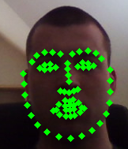
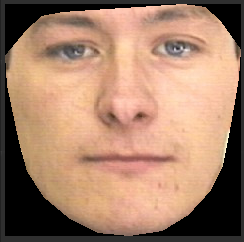
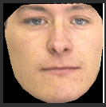
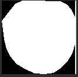
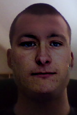

# Requirements

* OpenCV 3.*
* dlib

# The process

1. Detection of face and shape prediction (in two images / one image with two faces)

```c++
dlib::shape_predictor sp;
dlib::deserialize(datFile) >> "data/face_features.dat";

// Variables initialization
dlib::frontal_face_detector detector = dlib::get_frontal_face_detector();
dlib::array2d <dlib::rgb_pixel> img;

// Conversion of OpenCV image into dlib image
dlib::assign_image(img, dlib::cv_image<dlib::bgr_pixel>(_img));

vector<dlib::rectangle> dets = detector(img);

vector<dlib::full_object_detection> shapes;
// Detection of face renctangles
for (unsigned long j = 0; j < dets.size(); ++j) {
  dlib::full_object_detection shape = sp(img, dets[j]);
  shapes.push_back(shape);
}

// Custom structure
vector<Face> faces;

// Detection of face points
for (uint i = 0; i < min(shapes.size(), dets.size()); i++) {
  auto shape = shapes[i];
  auto det = dets[i];
  Face face;
  face.rect = Rect(det.left(), det.top(), det.width(), det.height());

  for (uint i = 0; i < shape.num_parts(); i++) {
    auto p = shape.part(i);
    face.points.push_back(Point(p.x(), p.y()));
  }
  face.hullPoints = pointsToHull(face.points);

  faces.push_back(face);
}
```



2. Shift points of both faces relative to their bounding box

```c++
vector<Point2f> srcPoints = pointsToF(srcFace.points);
Rect srcRect = boundingRect(srcPoints);
for (auto &p : srcPoints) {
  p.x -= srcRect.x;
  p.y -= srcRect.y;
}
vector<Point2f> dstPoints = pointsToF(dstFace.points);
Rect dstRect = boundingRect(dstPoints);
for (auto &p : dstPoints) {
  p.x -= dstRect.x;
  p.y -= dstRect.y;
}
```

3. Find perspective transformation

```c++
Mat homography = findHomography(srcPoints, dstPoints);
```

4. Extract source face into separate subimage

```c++
Mat face1, mask1;
// Prepare the mask of face, as big as the bounding box of the face
Rect rect = boundingRect(face.hullPoints);
Size size = Size(rect.width, rect.height);
mask1 = Mat::zeros(size, CV_8U);

// Shift hull points to small mask coordinates (originally they are for the full image)
vector<Point> hull = face.hullPoints;
for (auto &p : hull) {
  p.x -= rect.x;
  p.y -= rect.y;
}
// Fill hull - it's the mask of face
fillConvexPoly(mask1, hull, Scalar(255));

// Copy the part inside the face rectangle defined by face mask into the output
img(rect).copyTo(face1, mask1);
```



5. Transform extracted face into another separate subimage

```c++
Mat face2, mask2;
warpPerspective(face1, face2, homography, Size(dstRect.width, dstRect.height));
```



6. Find mask of transformed face in the subimage
	
```c++
mask2 = Mat::zeros(face2.size(), CV_8U);
vector<Point> maskPoints = dstFace.hullPoints;
for (auto &p : maskPoints) {
  p.x -= dstRect.x;
  p.y -= dstRect.y;
}
fillConvexPoly(mask2, maskPoints, Scalar(255));
```



7. Seamlessly clone (performs color blending) transformed face into destination image

```c++
seamlessClone(face2, dst, mask2, pointsCenter(rectToPoints(dstRect)), dst, NORMAL_CLONE);
```



# The result

The face swap looks quite realistically, although the speed is not sufficient for real-time.

# Limitations

* rotated face
* hairs overlaying face
